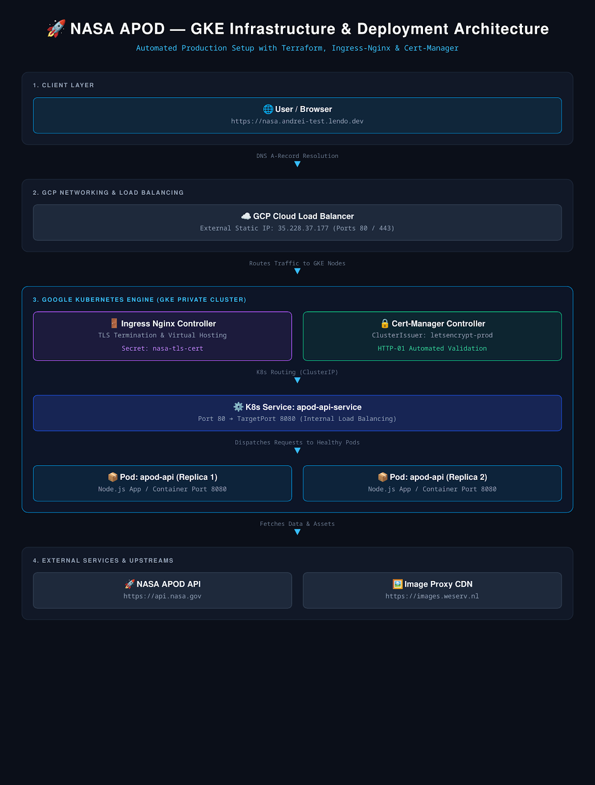

# 🌌 Production-Ready Infrastructure on GKE (GitOps & Multi-Service Platform)

Comprehensive guide to deploying a GitOps-managed, multi-service platform on Google Cloud Platform (GCP) using **Terraform**, **Google Kubernetes Engine (GKE)**, **ArgoCD**, **WireGuard VPN**, **Nginx Ingress Controller**, and **Cert-Manager (Let's Encrypt)** with automated TLS termination across subdomains (`*.andrei-test.lendo.dev`).

---

## 🏛️ System Architecture



---

## 📁 Repository Structure

```text
.
├── docs/
│   └── architecture_diagram.png # Infrastructure & network topology diagram
├── gke.tf                    # Terraform: VPC, private subnets, NAT gateway, & GKE cluster
├── helm_providers.tf         # Terraform: Helm provider configuration
├── helm_ingress_nginx.tf     # Terraform: Nginx Ingress Controller deployment (Static External IP)
├── helm_cert_manager.tf      # Terraform: cert-manager installation
├── providers.tf              # Terraform: GCP & Kubernetes provider settings
├── argocd-app.yaml           # ArgoCD: Root Application definition (GitOps App-of-Apps pattern)
├── k8s-manifests/
│   ├── cluster-issuer.yaml   # Cert-Manager ClusterIssuer (Let's Encrypt Production)
│   ├── apod-deployment.yaml  # NASA APOD Web & API Deployment
│   ├── apod-service.yaml     # ClusterIP Service for NASA APOD
│   ├── apod-ingress.yaml     # Ingress routing & TLS cert spec for NASA APOD
│   ├── wireguard-deployment.yaml # WireGuard VPN (wg-easy:11) Deployment & ClusterIP Service
│   └── wireguard-ingress.yaml    # Ingress routing & TLS cert spec for WireGuard Web UI
└── README.md
```

## 🚀 Deployment Guide

1. ### Provision Infrastructure (Terraform)

   Ensure you have the gcloud CLI authorized and terraform installed.

```Shell
# 1. Initialize Terraform providers and modules
terraform init

# 2. Preview planned infrastructure changes
terraform plan

# 3. Apply the configuration (provisions VPC, GKE, Nginx Ingress, and cert-manager)
terraform apply -auto-approve
```

2. ### Connect to the GKE Cluster

   Once terraform apply completes successfully, fetch the cluster credentials:

```Shell
gcloud container clusters get-credentials gke-private-cluster \
  --region YOUR_PROJECT_REGION \
  --project YOUR_PROJECT_ID
```

3. ### Apply cluster-issuer

```shell
kubectl apply -f k8s-manifests/cluster-issuer.yaml
```

4. ### Apply all k8s manifests

   ```shell
   kubectl apply -f k8s-manifests/
   ```


## 🌐 Application & Management Endpoints

| **Endpoint**                                        | **Service** | **Auth Credentials**          | **Description**                          |
| --------------------------------------------------------- | ----------------- | ----------------------------------- | ---------------------------------------------- |
| **`https://nasa.andrei-test.lendo.dev`**          | NASA APOD Web UI  | Public                              | Interactive astronomy media viewer & dashboard |
| **`https://nasa.andrei-test.lendo.dev/v1/apod/`** | NASA APOD API     | Public                              | Raw JSON metadata proxy for APOD service       |
| **`https://argocd.andrei-test.lendo.dev`**        | ArgoCD UI         | `admin`/*(retrieved in step 3)* | GitOps CD management console                   |
| **`https://vpn.andrei-test.lendo.dev`**           | WireGuard Web UI  | `admin`                           | VPN user & profile management portal           |
